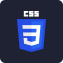
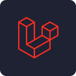
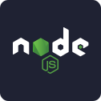
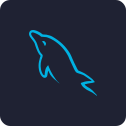

### Hay There :wave:

### Hay, Nice To Meet You
Hey, nice to meet you, I’m Roymond Chandra Pradana, but people here call me Remon. I grew up in Indonesia, and I can speak Indonesia and a little bit of English. I love to code and design. For my profile and what I work on, you can visit this website for more details about me  <a href="https://antroyz1.github.io/" target="_blank"> Antroyz1.github.io</a>.
## :footprints: I am an ordinary web designer and web developer.

<!-- 
 -->

## 🔥 Technologies & Tools

  
  <!--  -->
  <!--  -->
  
  
  
  
  
  
  
  
  
  <!--  -->
  
  <!--  -->

